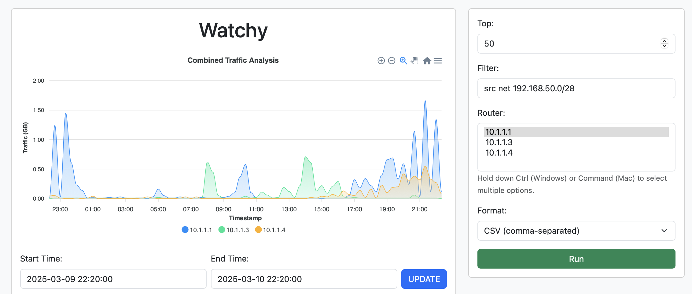
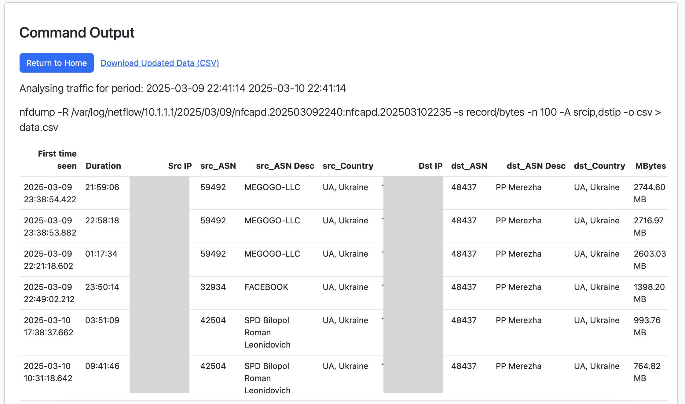

# watchy-tool

## Overview
The WATCHY tool is a web-based application designed to replace the functionality of NFSen for analyzing NetFlow data. This tool provides a user-friendly interface for visualizing network traffic and managing NetFlow data files.

## Features
- **Dynamic Data Visualization**: Utilizes JavaScript for interactive graphs and charts.
- **NetFlow Data Management**: Scripts to process and organize NetFlow data files.
- **Web Interface**: Built with Flask, allowing users to submit queries and view results in a browser.
- **Data Download**: Options to download processed data in CSV format.

## Project Structure
```
watchy-tool
├── static
│   └── assets
│       └── script.js          # JavaScript for frontend interactions
├── templates
│   ├── index.html             # Main HTML template for user input
│   └── output.html            # Template for displaying command output
├── move_nfcapd.sh             # Script to process and move NetFlow files
├── delete_empty_flows.sh      # Script to delete empty NetFlow files
├── run_nfcapd.sh              # Script to start nfcapd for devices
├── watchy_modules.py          # Python module for data processing and graph generation
├── web_analyse.py             # Main Flask application file
├── generate_DB.py             # Python module for DB operations
├── install.sh                 # Installation script
└── README.md                  # Project documentation
```

## Installation
1. Clone the repository:
   ```
   git clone https://github.com/AlexFrost96/watchy.git
   cd watchy-tool
   ```
2. You need to install nfdump-1.7.x or nfdump unicorn from https://github.com/phaag/nfdump. The installation of nfdump is out of the scope of this document.

3. Install MariaDB. You can follow the instructions from [How To Install MariaDB on Ubuntu 22.04](https://www.digitalocean.com/community/tutorials/how-to-install-mariadb-on-ubuntu-22-04). The installation of MariaDB is out of the scope of this document.

4. Download the GeoLite2 databases:
- **GeoLite2-ASN.mmdb**
- **GeoLite2-Country.mmdb**

Place these files in the project directory.

5. Run the installation script:
   ```
   ./install.sh
   ```
   This script will:
   - Install the required Python packages.
   - Create a systemd service file for the Flask web application.
   - Enable and start the WATCHY service.
   - Create a cron job to process NetFlow files every minute and write processed data to Maria DB.

6. Open your web browser and navigate to http://localhost:5000

## Usage

1. Use the form on the main page to input your desired parameters for analyzing NetFlow data.



2. View the results on the output page, where you can also download the processed data.



## Scripts
- **move_nfcapd.sh**: Organizes NetFlow files into directories based on their creation date and generates database entries.
- **delete_empty_flows.sh**: Cleans up empty NetFlow files to maintain a tidy log directory.
- **run_nfcapd.sh**: Initializes the nfcapd process for each device listed in `config.txt`.
- **generate_DB.py**: Processes NetFlow files and inserts the extracted data into a MariaDB database.

## Contributing
Contributions are welcome! Please submit a pull request or open an issue for any enhancements or bug fixes.

## License
This project is licensed under the MIT License. See the LICENSE file for more details.